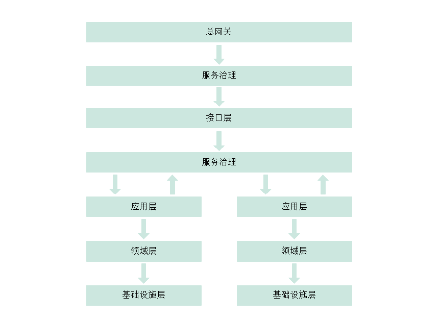

# mrh-ddd

    Domain Driven Design，简称 DDD，系统分析和设计的面向对象建模方法

    领域驱动应该作为一种建模的思想，而不是作为项目具体实现划分包结构的手段

## 领域建模

    

## 包结构

    如下所示：

        +-- facade              接口层
        +
        +-- application         应用层
        +
        +-- action              领域层
        +
        +-- infrastructure      基础设施层

## 服务调用过程

微服务中的调用关系，不允许跨层调用：

## 接口层

    主要职责：

        与客户端进行交互的一层，该层主要职责为参数定义、参数验证、数据组装、状态转换、文档定义等

    职责说明：

        参数定义，可以理解为，根据前端或原型设计对较粗粒度的应用数据进行精准过滤、精准转换

        参数验证，使用 JSR 进行请求参数校验

        数据组装，单个应用服务数据不足以满足业务，可以调用多个应用后再组装返回

        状态转换，接口层可能存在用户有状态或无状态信息(session、header)，在此层进行验证转换为应用接口参数

        文档定义，使用 swagger2 生成实时接口文档，类库耦合度高，在此层进行不允许传递到其他层

## 应用层

    协调单个或多个领域服务，很薄的一层，提供给接口层、其他微服务调用

    注意，该层不应该包含复杂的业务逻辑，只提供简单的流转状态，并且将业务逻辑沉淀到领域层

    注意，该层的应用之间不应该互相调用，领域层已经有实现，调用领域层即可

## 领域层

    最重要的一层，提供粒度比较小的业务逻辑，过滤某些业务无需的字段

    注意，该层粒度已经足够小，领域之间应该完全禁止互相调用，降低领域之间耦合度

## 基础设施层

    提供持久化、消息队列、数据缓存等最基础的功能

    例如，接入 mysql、redis、kafka、mybatis等

## 示例代码

    下载本项目源代码进行查看

    通常增删改查分层定义会比较繁琐，但是如果多个业务都有相同的逻辑实现，复用性更强

    例如，两个方法都有对用户角色进行更新的操作，与传统的 MVC 相比复用度更高，service层更薄：

        org.lushen.mrh.ddd.application.UserApplication#registerWithRole

        org.lushen.mrh.ddd.application.UserApplication#updateWithRole
